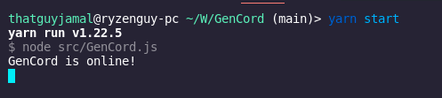

# Warning

As of (4/12/21) [Gencord](https://github.com/Gencord/gencord) is being rebuilt from the ground up. All code used here is on the legacy verison.

Check back later when this code is updated to a stable version of gencord. Thanks!

# Quick Start

`git clone https://github.com/ThatGuyJamal/gencord-exmaple`

### Run the following

Yarn: `yarn init -y` then run `yarn install`

or if you prefer npm (You dont have or need to run both yarn and npm)

NPM: `npm init -y` then run `npm install`

Lastly run: `yarn start` This will launch the bot. (assumes you have filled out the config.json file. Make sure to rename exmaple.config.json to config.json)

> To run with nodemon use `yarn demon`

If eveything goes well you should see:

# gencord-exmaple

This is an example bot of the Alpa version of [gencord](https://github.com/Gencord/gencord).

## Whats Gencord?

A new and simple Discord API framework. Used for building discord bots.

## Offical Repo

The Offical Repository can be found [here](https://github.com/Gencord/gencord). If you want to make an issue or pull request please go to the original GitHub repository and not this one, this is only an example bot.

> However, if something pertaining to this example bot, feel free to make a issue or pull request. Thanks.

## Want to add the bot to your server?

Click [here](https://discord.com/api/oauth2/authorize?client_id=816050426747027527&permissions=2147552256&scope=bot) to add the bot. As of now it only needs minimum permissions to work.

## New to Discord Bot making?

More coming on this section soon.
